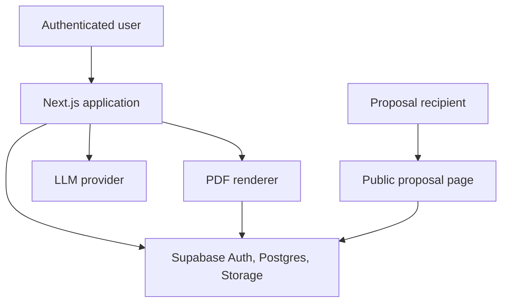
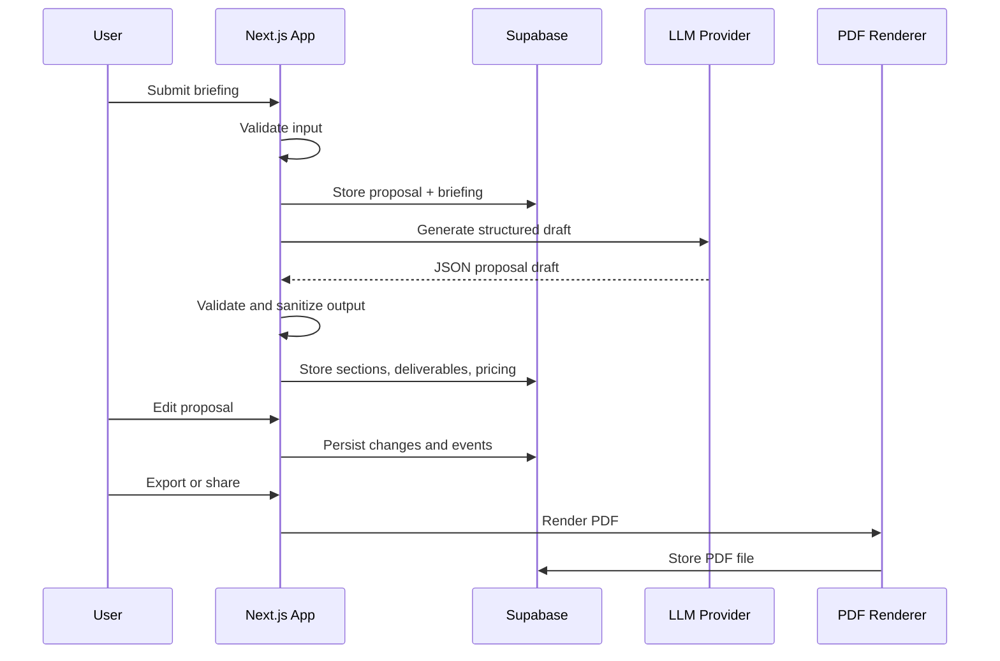
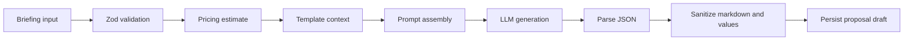

# Architecture

## Principles

ProposalForge should be built as a small, well-bounded SaaS application. The architecture favors explicit domain modules, server-side validation, secure data access and deterministic state transitions.

The current public demo is a local Next.js UI and pure domain foundation. Supabase Auth, database persistence, LLM calls, PDF export and public acceptance routes remain target architecture unless explicitly implemented in later phases.

Guiding principles:

- Keep generated content separate from structured commercial data.
- Treat LLM output as untrusted until parsed and validated.
- Use Supabase Row Level Security for all user-owned records.
- Use server-side operations for proposal generation, PDF export and acceptance writes.
- Keep status changes auditable through proposal events.
- Prefer clear feature modules over broad utility folders.

## System Context



## High-Level Flow



## Recommended Source Structure

```text
src/
  app/
    (auth)/
      login/
      signup/
    (dashboard)/
      dashboard/
      proposals/
        new/
        [proposalId]/
    p/
      [shareToken]/
    api/
      proposals/
      public/
      pricing/
  components/
    ui/
    layout/
  features/
    briefings/
    proposals/
    pricing/
    templates/
    public-proposals/
  server/
    ai/
    pdf/
    supabase/
    security/
  lib/
    dates/
    money/
    result/
  types/
  tests/
```

## Feature Boundaries

| Module | Responsibility | Should Not Own |
| --- | --- | --- |
| `briefings` | Briefing form schema, normalization and initial proposal input. | LLM calls or PDF rendering. |
| `proposals` | Proposal lifecycle, editor state, sections, deliverables and statuses. | Auth implementation details. |
| `pricing` | Scope-based price estimates, line item math and currency formatting. | Proposal copy generation. |
| `templates` | Template metadata, default sections and default pricing rules. | User-specific proposal state. |
| `public-proposals` | Public read model, sharing and acceptance flow. | Dashboard-only editing. |
| `server/ai` | Provider adapter, prompt versions, structured output validation. | UI components. |
| `server/pdf` | HTML-to-PDF rendering, file naming and storage. | Proposal business rules. |
| `server/supabase` | Supabase clients, typed database helpers and RLS-safe access. | Domain logic. |

## Route Map

| Route | Purpose |
| --- | --- |
| `/` | Product or lightweight marketing entry point. |
| `/login` | Authentication. |
| `/signup` | Account creation. |
| `/dashboard` | Proposal overview and recent activity. |
| `/proposals/new` | Briefing form and template selection. |
| `/proposals/[proposalId]` | Editor, preview, status and export actions. |
| `/p/[shareToken]` | Public proposal page for recipients. |

## Server-Side Operations

Use server actions for authenticated dashboard mutations when possible:

- Create proposal from briefing.
- Save proposal edits.
- Change proposal status.
- Create share link.
- Trigger PDF export.

Use route handlers for:

- Public proposal read model.
- Public acceptance submission.
- PDF file responses.
- Webhook-style future integrations.

## Data Ownership

Every proposal belongs to exactly one authenticated user. Proposal recipients never receive database accounts in the MVP. Public access should be based on unguessable share tokens and limited read models.

Sensitive writes, including proposal acceptance and status changes, must happen on the server. Never trust client-provided owner IDs, totals, statuses or section ordering.

## Proposal Generation Pipeline



## PDF Export

PDF rendering should use the stored proposal data, not a fresh LLM response. The renderer should produce a deterministic document from the same sections shown in the proposal editor and public page.

Recommended behavior:

- Generate PDF only from saved proposal versions.
- Store exports in Supabase Storage.
- Record export metadata in `pdf_exports`.
- Include proposal ID, version and timestamp in file names.

## Public Sharing and Acceptance

Public proposal pages should expose only recipient-safe data:

- Proposal title and client-facing content.
- Scope, deliverables, timeline and pricing.
- Expiration date and acceptance terms.
- Optional PDF download.

Acceptance should capture signer name, email, signature text, timestamp, IP hash and user agent. The app should describe this as simple acceptance, not a full legal e-signature product.

## Security Requirements

- Enable RLS on every Supabase table in `public`.
- Validate all incoming requests with schemas.
- Do not expose service-role keys to the browser.
- Hash or redact IP addresses in acceptance records.
- Store prompt inputs and outputs only when needed for debugging and audit.
- Avoid sending private user data to the LLM unless it is necessary for generation.
- Rate limit generation, export and public acceptance endpoints.

## Testing Strategy

Minimum test coverage should include:

- Pricing rule calculations.
- Proposal status transition rules.
- LLM JSON parsing and validation failures.
- Public share token access.
- Acceptance submission.
- PDF export metadata creation.
- Critical Playwright flow: create briefing, generate draft, edit, share and accept.
