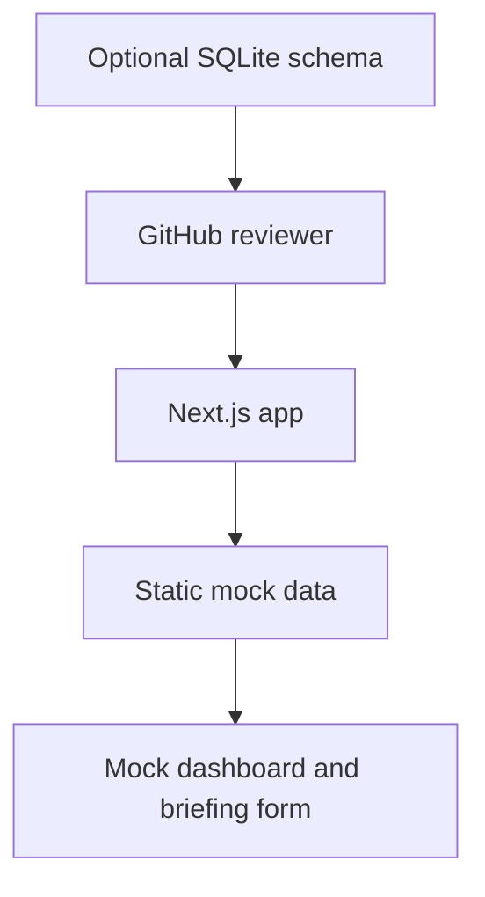
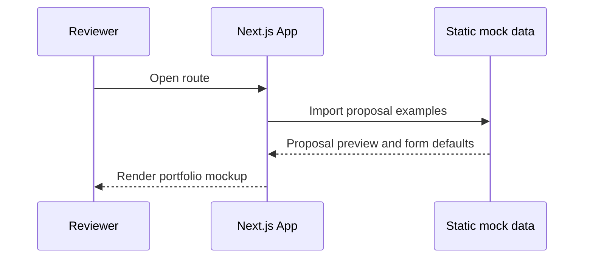

# Architecture

## Current Scope

ProposalForge is currently a public portfolio mockup. The app is a static Next.js UI that reads local TypeScript mock data and ships an optional SQLite schema for reviewers who want to inspect the data model.

There is no runtime authentication, database connection, LLM provider, PDF renderer or public acceptance service in this phase.

## Principles

- Keep the project easy to run without external services.
- Make the UI visible and understandable for GitHub reviewers.
- Keep domain logic pure where possible.
- Treat LLM output as untrusted before any future rendering or persistence.
- Keep future production concerns documented, not half-implemented.
- Avoid secrets and private customer data in the public repository.

## System Context



## Current Source Structure

```text
src/
  app/
    dashboard/
    proposals/
      new/
  components/
    ui/
    layout/
  data/
    mock-proposals.ts
  features/
    briefings/
    proposals/
    pricing/
  server/
    ai/
  lib/
  tests/
sqlite/
  schema.sql
  seed.sql
```

## Feature Boundaries

| Module | Responsibility | Should Not Own |
| --- | --- | --- |
| `app` | Route composition and page-level UI. | Runtime persistence. |
| `components` | Shared layout and UI primitives. | Business rules. |
| `data` | Static portfolio mock data. | Real customer data. |
| `briefings` | Briefing schema and validation. | LLM calls or PDF rendering. |
| `proposals` | Proposal status rules. | Auth implementation details. |
| `pricing` | Scope-based pricing calculations. | Proposal copy generation. |
| `server/ai` | Generated draft parsing and validation examples. | Provider credentials. |

## Route Map

| Route | Purpose |
| --- | --- |
| `/` | Portfolio entry page with proposal preview. |
| `/dashboard` | Static dashboard mockup with sample pipeline data. |
| `/proposals/new` | Prefilled briefing form mockup. |

## Data Flow



## Future Production Work

If this portfolio mockup becomes a real SaaS, add separate implementation decisions for:

- Authentication and authorization.
- Runtime persistence.
- LLM provider integration.
- PDF generation and storage.
- Public proposal links and acceptance writes.
- Rate limiting and observability.

Those concerns are intentionally not wired into the current public demo.

## Security Requirements

- Do not commit real credentials.
- Do not store real customer data in seeds.
- Keep future server-only credentials out of client components.
- Validate future request payloads with schemas.
- Add authorization tests before treating the app as multi-user.

## Testing Strategy

Current test coverage should focus on:

- Pricing rule calculations.
- Proposal status transition rules.
- LLM JSON parsing and validation failures.

Future tests can add Playwright coverage for the visible mockup routes and integration tests if runtime persistence is introduced.
