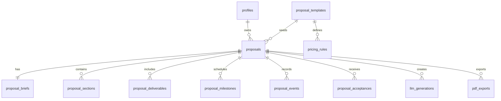

# Database Design

## Overview

Supabase should own authentication, relational data, Row Level Security and PDF storage. The schema should keep structured proposal data queryable while allowing proposal sections to be edited flexibly.

For the current portfolio demo, Supabase is not required at runtime. Manual SQL files are available in [`../supabase/migrations/`](../supabase/migrations/) and [`../supabase/seed.sql`](../supabase/seed.sql) for users who want to provision a Supabase project.

## Entities



## Tables

### `profiles`

Stores public application profile data for `auth.users`.

| Column | Type | Notes |
| --- | --- | --- |
| `id` | `uuid` | Primary key, references `auth.users(id)`. |
| `display_name` | `text` | User-visible name. |
| `company_name` | `text` | Optional agency or freelancer brand. |
| `created_at` | `timestamptz` | Default `now()`. |
| `updated_at` | `timestamptz` | Updated by trigger. |

### `proposal_templates`

Stores global proposal templates.

| Column | Type | Notes |
| --- | --- | --- |
| `id` | `uuid` | Primary key. |
| `slug` | `text` | Unique template key. |
| `name` | `text` | Display name. |
| `description` | `text` | Short explanation. |
| `default_sections` | `jsonb` | Ordered section definitions. |
| `default_deliverables` | `jsonb` | Suggested deliverables. |
| `is_active` | `boolean` | Hide inactive templates. |

### `proposals`

Main proposal record.

| Column | Type | Notes |
| --- | --- | --- |
| `id` | `uuid` | Primary key. |
| `owner_id` | `uuid` | References `profiles(id)`. |
| `template_id` | `uuid` | References `proposal_templates(id)`. |
| `title` | `text` | Proposal title. |
| `client_name` | `text` | Client or company name. |
| `client_email` | `text` | Optional recipient email. |
| `status` | `proposal_status` | `draft`, `sent`, `accepted`, `rejected`. |
| `currency` | `text` | ISO currency code. |
| `subtotal_amount` | `numeric(12,2)` | Sum before discounts or taxes. |
| `discount_amount` | `numeric(12,2)` | Optional discount. |
| `tax_amount` | `numeric(12,2)` | Optional tax. |
| `total_amount` | `numeric(12,2)` | Final displayed amount. |
| `valid_until` | `date` | Proposal expiration. |
| `share_token` | `text` | Unique, unguessable public token. |
| `sent_at` | `timestamptz` | Set when status becomes `sent`. |
| `accepted_at` | `timestamptz` | Set when accepted. |
| `rejected_at` | `timestamptz` | Set when rejected. |
| `created_at` | `timestamptz` | Default `now()`. |
| `updated_at` | `timestamptz` | Updated by trigger. |

### `proposal_briefs`

Stores the user-provided briefing separate from generated content.

| Column | Type | Notes |
| --- | --- | --- |
| `proposal_id` | `uuid` | Primary key, references `proposals(id)`. |
| `client_type` | `text` | Startup, local business, agency, etc. |
| `problem` | `text` | Client pain. |
| `objective` | `text` | Desired business outcome. |
| `budget_min` | `numeric(12,2)` | Optional minimum budget. |
| `budget_max` | `numeric(12,2)` | Optional maximum budget. |
| `deadline` | `date` | Desired completion date. |
| `services` | `text[]` | Selected service keys. |
| `constraints` | `text` | Known constraints. |
| `raw_notes` | `text` | Additional free-form notes. |

### `proposal_sections`

Editable proposal content.

| Column | Type | Notes |
| --- | --- | --- |
| `id` | `uuid` | Primary key. |
| `proposal_id` | `uuid` | References `proposals(id)`. |
| `position` | `integer` | Ordered display position. |
| `kind` | `text` | `summary`, `problem`, `solution`, `scope`, `timeline`, `pricing`, `terms`, etc. |
| `title` | `text` | Section heading. |
| `content_md` | `text` | Sanitized Markdown body. |
| `metadata` | `jsonb` | Optional structured data. |

### `proposal_deliverables`

Structured deliverables and pricing line items.

| Column | Type | Notes |
| --- | --- | --- |
| `id` | `uuid` | Primary key. |
| `proposal_id` | `uuid` | References `proposals(id)`. |
| `position` | `integer` | Ordered display position. |
| `category` | `text` | Service category. |
| `title` | `text` | Deliverable name. |
| `description` | `text` | Deliverable description. |
| `quantity` | `numeric(10,2)` | Quantity or unit count. |
| `unit_price` | `numeric(12,2)` | Unit price. |
| `amount` | `numeric(12,2)` | Calculated amount. |

### `proposal_milestones`

Timeline and delivery plan.

| Column | Type | Notes |
| --- | --- | --- |
| `id` | `uuid` | Primary key. |
| `proposal_id` | `uuid` | References `proposals(id)`. |
| `position` | `integer` | Ordered display position. |
| `title` | `text` | Milestone title. |
| `description` | `text` | Work completed in this milestone. |
| `duration_days` | `integer` | Estimated duration. |
| `starts_after_days` | `integer` | Offset from project start. |

### `proposal_events`

Audit trail for important changes.

| Column | Type | Notes |
| --- | --- | --- |
| `id` | `uuid` | Primary key. |
| `proposal_id` | `uuid` | References `proposals(id)`. |
| `actor_type` | `text` | `owner`, `recipient`, `system`. |
| `event_type` | `text` | `created`, `generated`, `edited`, `sent`, `viewed`, `accepted`, `rejected`, `pdf_exported`. |
| `metadata` | `jsonb` | Event-specific data. |
| `created_at` | `timestamptz` | Default `now()`. |

### `proposal_acceptances`

Simple acceptance record.

| Column | Type | Notes |
| --- | --- | --- |
| `id` | `uuid` | Primary key. |
| `proposal_id` | `uuid` | References `proposals(id)`. |
| `signer_name` | `text` | Required. |
| `signer_email` | `text` | Required. |
| `signature_text` | `text` | Typed signature. |
| `ip_hash` | `text` | Hashed or redacted IP. |
| `user_agent` | `text` | User agent string. |
| `accepted_terms_at` | `timestamptz` | Checkbox confirmation time. |
| `created_at` | `timestamptz` | Default `now()`. |

### `llm_generations`

Tracks generation attempts for debugging and audit.

| Column | Type | Notes |
| --- | --- | --- |
| `id` | `uuid` | Primary key. |
| `proposal_id` | `uuid` | References `proposals(id)`. |
| `provider` | `text` | LLM provider. |
| `model` | `text` | Model name. |
| `prompt_version` | `text` | Versioned prompt key. |
| `status` | `text` | `succeeded`, `failed`, `repaired`. |
| `input_hash` | `text` | Hash of normalized input. |
| `output_json` | `jsonb` | Validated structured output when retained. |
| `token_usage` | `jsonb` | Provider token metadata. |
| `error_message` | `text` | Sanitized error. |
| `created_at` | `timestamptz` | Default `now()`. |

### `pdf_exports`

Stores generated PDF metadata.

| Column | Type | Notes |
| --- | --- | --- |
| `id` | `uuid` | Primary key. |
| `proposal_id` | `uuid` | References `proposals(id)`. |
| `storage_path` | `text` | Supabase Storage path. |
| `proposal_version` | `integer` | Version rendered. |
| `file_size_bytes` | `integer` | Optional. |
| `created_at` | `timestamptz` | Default `now()`. |

### `pricing_rules`

Template and service pricing defaults.

| Column | Type | Notes |
| --- | --- | --- |
| `id` | `uuid` | Primary key. |
| `template_id` | `uuid` | References `proposal_templates(id)`. |
| `service_key` | `text` | Service identifier. |
| `base_price` | `numeric(12,2)` | Default price. |
| `complexity_multiplier` | `numeric(6,3)` | Multiplier by complexity. |
| `rush_multiplier` | `numeric(6,3)` | Multiplier for short deadlines. |
| `is_active` | `boolean` | Enables or disables the rule. |

## Enums

```sql
create type proposal_status as enum ('draft', 'sent', 'accepted', 'rejected');
```

## Indexes

Recommended indexes:

- `proposals(owner_id, updated_at desc)`
- `proposals(owner_id, status)`
- `proposals(share_token)` unique where `share_token is not null`
- `proposal_sections(proposal_id, position)`
- `proposal_deliverables(proposal_id, position)`
- `proposal_events(proposal_id, created_at desc)`
- `pdf_exports(proposal_id, created_at desc)`

## RLS Model

Enable RLS on all tables.

Policy summary:

- Authenticated users can select, insert, update and delete their own proposals while status rules allow it.
- Authenticated users can select template records where `is_active = true`.
- Child records are accessible only when the parent proposal belongs to `auth.uid()`.
- Public proposal reads should use a narrow function or view that resolves `share_token` and returns only client-safe fields.
- Public acceptance writes should use a server route with service-role access, never direct anonymous table writes.

## Storage

Use a private Supabase Storage bucket for PDFs.

Recommended bucket:

- `proposal-pdfs`

Access PDFs through signed URLs generated server-side. Public pages can expose a signed URL with a short expiry if PDF downloads are enabled.
