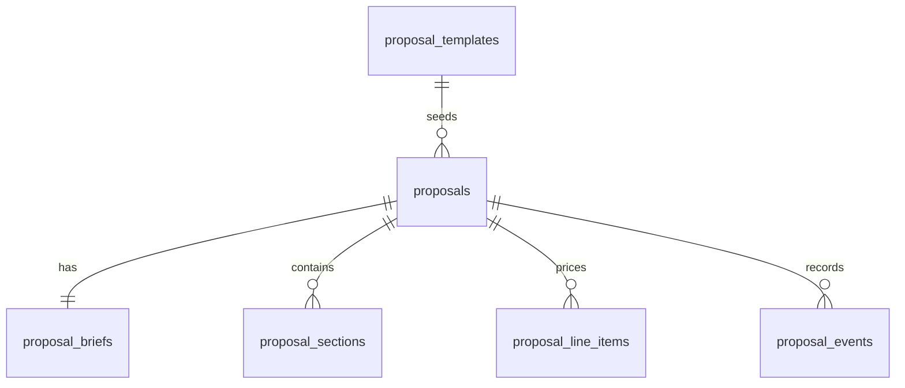

# Database Design

## Overview

ProposalForge uses SQLite as the lightweight data model for this public portfolio demo. The current Next.js UI does not connect to SQLite at runtime; it uses static mock data so reviewers can open the project without installing database services.

The optional SQL files live in [`../sqlite/schema.sql`](../sqlite/schema.sql) and [`../sqlite/seed.sql`](../sqlite/seed.sql).

## Scope

SQLite is used here to document a simple local data shape:

- Proposal templates.
- Proposal records.
- Client brief details.
- Editable proposal sections.
- Pricing line items.
- Proposal events.

The model intentionally excludes multi-user authentication, row-level security, object storage and production audit requirements. Those would be separate product work, not part of this portfolio mockup.

## Local Usage

```bash
sqlite3 proposalforge.db < sqlite/schema.sql
sqlite3 proposalforge.db < sqlite/seed.sql
```

The app does not read this file automatically. It exists for reviewers who want to inspect or extend the data model locally.

## Entities



## Tables

### `proposal_templates`

Stores reusable proposal template metadata.

| Column | Type | Notes |
| --- | --- | --- |
| `id` | `text` | Primary key. |
| `slug` | `text` | Unique template key. |
| `name` | `text` | Display name. |
| `description` | `text` | Short explanation. |
| `created_at` | `text` | SQLite timestamp. |

### `proposals`

Main proposal record.

| Column | Type | Notes |
| --- | --- | --- |
| `id` | `text` | Primary key. |
| `template_id` | `text` | Optional template reference. |
| `title` | `text` | Proposal title. |
| `client_name` | `text` | Mock client name. |
| `client_email` | `text` | Optional recipient email. |
| `status` | `text` | `draft`, `sent`, `accepted`, `rejected`. |
| `currency` | `text` | ISO currency code. |
| `total_amount_cents` | `integer` | Total stored as cents. |
| `valid_until` | `text` | ISO date. |
| `created_at` | `text` | SQLite timestamp. |
| `updated_at` | `text` | SQLite timestamp. |

### `proposal_briefs`

Stores the client context behind a proposal.

| Column | Type | Notes |
| --- | --- | --- |
| `proposal_id` | `text` | Primary key and proposal reference. |
| `client_type` | `text` | Agency, startup, clinic, etc. |
| `problem` | `text` | Client pain. |
| `objective` | `text` | Desired outcome. |
| `budget_min_cents` | `integer` | Optional minimum budget. |
| `budget_max_cents` | `integer` | Optional maximum budget. |
| `deadline` | `text` | ISO date. |
| `services_json` | `text` | JSON string for selected services. |
| `constraints` | `text` | Known constraints. |
| `notes` | `text` | Internal notes. |

### `proposal_sections`

Editable proposal content.

| Column | Type | Notes |
| --- | --- | --- |
| `id` | `text` | Primary key. |
| `proposal_id` | `text` | Proposal reference. |
| `position` | `integer` | Display order. |
| `kind` | `text` | `summary`, `scope`, `timeline`, `pricing`, etc. |
| `title` | `text` | Section heading. |
| `content_md` | `text` | Markdown content. |

### `proposal_line_items`

Structured pricing rows.

| Column | Type | Notes |
| --- | --- | --- |
| `id` | `text` | Primary key. |
| `proposal_id` | `text` | Proposal reference. |
| `position` | `integer` | Display order. |
| `title` | `text` | Line item name. |
| `description` | `text` | Optional detail. |
| `quantity` | `integer` | Unit count. |
| `unit_price_cents` | `integer` | Unit price in cents. |
| `amount_cents` | `integer` | Calculated amount in cents. |

### `proposal_events`

Simple event timeline.

| Column | Type | Notes |
| --- | --- | --- |
| `id` | `text` | Primary key. |
| `proposal_id` | `text` | Proposal reference. |
| `event_type` | `text` | `created`, `edited`, `sent`, etc. |
| `note` | `text` | Optional human-readable detail. |
| `created_at` | `text` | SQLite timestamp. |

## Security Notes

This portfolio version has no user accounts and no production data. If runtime persistence is added later:

- Keep secrets in `.env.local` or hosting provider secrets.
- Validate all writes server-side.
- Avoid storing private customer data in demo seeds.
- Add tests around authorization before treating it as a multi-user app.
